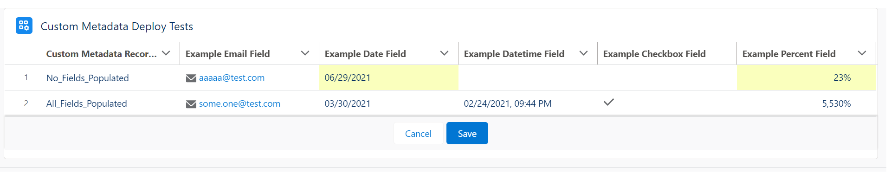
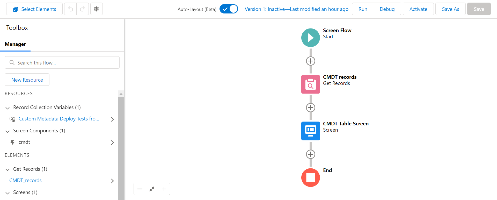
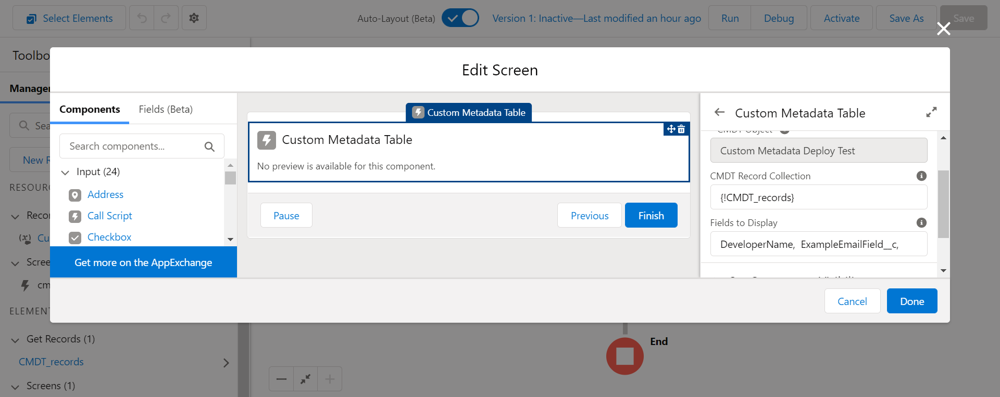
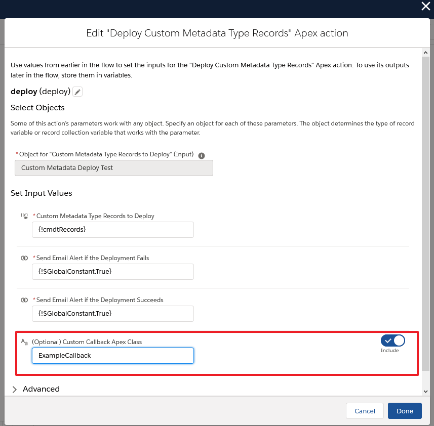

# Custom Metadata Saver for Salesforce

<a href="https://githubsfdeploy.herokuapp.com?owner=jongpie&repo=CustomMetadataSaver&ref=main">
  
</a>

This is a small library that can be used in Salesforce to update & deploy changes to custom metadata types (CMDT) from Apex and Flow.

---

## Use Included Lightning Web Component to Update CMDT Records

The included lwc `custom-metadata-table` is designed to work specifically with CMDT records. It includes 3 properties that you can set within Flow or your own lightning component

1. `records` - an instance of `List<SObject>` in Apex, or a 'record collection' within Flow, containing the CMDT records to display within the table.
    - All of the `SObject` records must be of the same `SObject Type`.
    - You can create or query the list of CMDT records - see README for details on how to create CMDT records in Apex and Flow.
    - When creating new CMDT records, you must populate both fields `DeveloperName` and `MasterLabel` in order to successfully deploy the new records.
2. `fieldToDisplay` - a comma-separated list of field API names that should be shown in the table.
    - When the parameter `enableEditing == true`, all fields, except `DeveloperName` and lookup fields, will be editable within the table. This is done via the `lightning-datatable`'s inline-editing functionality
3. `enableEditing` - Boolean value to control if CMDT records are displayed in read-only mode (`enableEditing == false`) or with inline-editing enabled (`enableEditing == true`)

Users can use this component to edit the CMDT records and simply click 'Save' to deploy any changes to the current org. The component then displays a loading-spinner while the deployment runs - it continues to check the deployment status until the deployment is done (either it suceeds or it fails).

In order to check the deployment's status, the component makes callouts to the REST API in your org - this is necessary because the deployment status cannot be checked natively within Apex. Depending on your org, some additional configuration may be needed to allow the callouts:

-   Org uses "My Domain": no additional changes should be required in your org - orgs with the "My Domain" feature configured can already make callouts to the same org without any additional configuration
-   Org does not use "My Domain": in your org, configure a Remote Site Setting - the URL of the remote site setting should be the URL of your Salesforce org

This screenshot shows an example of the table, using the include CMDT object `CustomMetadataDeployTest__mdt`



### Using custom-metadata-table in Flow

Within Flow, you can leverage the lwc `custom-metadata-table` in 2 steps

1. Query the list of CMDT records to display and store them in a record collection variable

    

2. Add a screen to display the `custom-metadata-table` component - here, you will provide the CMDT record collection variable and a comma-separated list of fields to display

    

---

## Use Backend Automations to Update CMDT Records

### Flow

Deploying CMDT changes from Flow consists of 2 actions

-   **Create a New Custom Metadata Record** (`FlowCustomMetadataCreator.newInstance(List<FlowInput> inputs)`) - this action creates a new in-memory instance of the specified CMDT object. This is needed because Salesforce does not allow you to create a new CMDT record directly in Flow. Each input has 3 attributes, and the `SObject` instance of the new CMDT record is returned.
    -   `String customMetadataTypeName` - The API name of the CMDT object
    -   `String masterLabel` - The value to use as the new CMDT record's label
    -   `String developerName` - The value to use as the new CMDT record's unique name


-   **Update your CMDT records using Flow** - Once you have either created a new CMDT record, or queried for existing CMDT records, you can use standard Flow assignments & loops to make changes to the CMDT records.


-   **Deploy Changes to Custom Metadata Records** (`CustomMetadataSaver.deploy(List<SObject> cmdtRecords)` - this action will asynchronously deploy any pending changes made to CMDT records. Simply pass in your collection of new and/or updated CMDT records, and the Apex action will deploy the changes.
    -   `List<SObject> cmdtRecords` - The collection of custom metadata records to deploy


### Apex

Since Apex can already update custom metadata records (it just can't save the changes using DML statements), it's fairly straightforward process to deploy the changes from Apex.

-   First, create or query for the CMDT records you want to update
-   Next, set any desired fields on your CMDT records
-   Finally, call the method `CustomMetadataSaver.deploy(List<SObject> cmdtRecords)` to deploy your records

```java
    // Create new CMDT record (or you can query existing records)
    CustomMetadataDeployTest__mdt myExampleCMDT = new CustomMetadataDeployTest__mdt();
    myExampleCMDT.MasterLabel = 'My CMDT Record';
    myExampleCMDT.DeveloperName = 'My_CMDT_Record';
    myExampleCMDT.ExampleTextField__c = 'Some value';

    // Add the new CMDT record to a list
    List<CustomMetadataDeployTest__mdt> records = new List<CustomMetadataDeployTest__mdt>{myExampleCMDT};

    // Finally, deploy your changes
    CustomMetadataSaver.deploy(records);

    // Bonus, get the deployment job IDs if you want to monitor them
    List<Id> deploymentJobIds = CustomMetadataSaver.getDeploymentJobIds();
```

## Custom Deployment Callback

When deploying metadata through Apex, Salesforce provides the ability to create a callback class using [Metadata.DeployCallback](https://developer.salesforce.com/docs/atlas.en-us.apexcode.meta/apexcode/apex_interface_Metadata_DeployCallback.htm).

### Using the Default Callback

Out-of-the-box, this `CustomMetadataSaver` uses a `private` inner class, `CustomMetadataSaver.DefaultDeployCallback`, when deploying CMDT records. It provides 2 options:

-   `sendEmailOnError` - sends an email to the current user when there are 1 or more deployment errors
-   `sendEmailOnSuccess` - sends an email to the current user when there are no deployment errors

### Using Your Own Custom Callback

To use your own custom Apex class for the callback, first create your class similar to this example

```java
public class ExampleCallback implements Metadata.DeployCallback {

    public void handleResult(Metadata.DeployResult result, Metadata.DeployCallbackContext context) {
        System.debug('ExampleCallback is running!');
    }
}

```

Within Apex, you can then pass an instance of your class as a parameter to the method `CustomMetadataSaver.deploy()`

```java
// Create your CMDT records
List<CustomMetadataDeployTest__mdt> myCMDTRecords = new List<CustomMetadataDeployTest__mdt>();

CustomMetadataDeployTest__mdt myExampleCMDT = new CustomMetadataDeployTest__mdt();
myExampleCMDT.MasterLabel = 'My CMDT Record';
myExampleCMDT.DeveloperName = 'My_CMDT_Record';
myExampleCMDT.ExampleTextField__c = 'Some value';

myCMDTRecords.add(myExampleCMDT);

// Create an instance of your custom callback class
ExampleCallback myCustomCallback = new ExampleCallback();

// Pass the CMDT records and your custom callback to CustomMetadataSaver
CustomMetadataSaver.deploy(myCMDTRecords, myCustomCallback);

```

Within Flow, you can also specify a custom callback class by specifying the Apex class name within the deploy action


