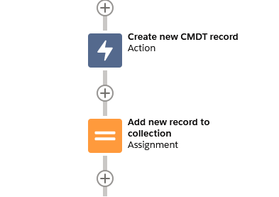
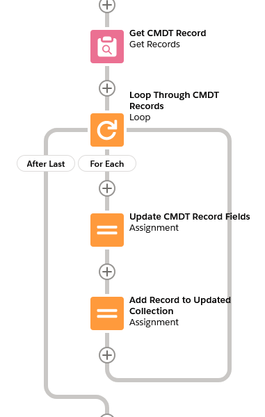
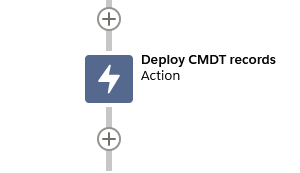

# Custom Metadata Saver for Salesforce

<a href="https://githubsfdeploy.herokuapp.com">
  
</a>

This is a small library that can be used in Salesforce to update & deploy changes to custom metadata types (CMDT) from Apex and Flow.

## Flow

Deploying CMDT changes from Flow consists of 2 actions

-   **Create a New Custom Metadata Record** (`FlowCustomMetadataCreator.newInstance(List<FlowInput> inputs)`) - this action creates a new in-memory instance of the specified CMDT object. This is needed because Salesforce does not allow you to create a new CMDT record directly in Flow. Each input has 3 attributes, and the `SObject` instance of the new CMDT record is returned.
    -   `String customMetadataTypeName` - The API name of the CMDT object
    -   `String masterLabel` - The value to use as the new CMDT record's label
    -   `String developerName` - The value to use as the new CMDT record's unique name



-   **Update your CMDT records using Flow** - Once you have either created a new CMDT record, or queried for existing CMDT records, you can use standard Flow assignments & loops to make changes to the CMDT records.



-   **Deploy Changes to Custom Metadata Records** (`CustomMetadataSaver.deploy(List<SObject> cmdtRecords)` - this action will asynchronously deploy any pending changes made to CMDT records. Simply pass in your collection of new and/or updated CMDT records, and the Apex action will deploy the changes.
    -   `List<SObject> cmdtRecords` - The collection of custom metadata records to deploy



## Apex

Since Apex can already update custom metadata records (it just can't save the changes using DML statements), it's fairly straightforward process to deploy the changes from Apex.

-   First, create or query for the CMDT records you want to update
-   Next, set any desired fields on your CMDT records
-   Finally, call the method `CustomMetadataSaver.deploy(List<SObject> cmdtRecords)` to deploy your records

```java
    // Create new CMDT record (or you can query existing records)
    CustomMetadataDeployTest__mdt myExampleCMDT = new CustomMetadataDeployTest__mdt();
    myExampleCMDT.MasterLabel = 'My CMDT Record';
    myExampleCMDT.DeveloperName = 'My_CMDT_Record';
    myExampleCMDT.ExampleTextField__c = 'Some value';

    // Add the new CMDT record to a list
    List<CustomMetadataDeployTest__mdt> records = new List<CustomMetadataDeployTest__mdt>{myExampleCMDT};

    // Finally, deploy your changes
    CustomMetadataSaver.deploy(records);

    // Bonus, get the deployment job IDs if you want to monitor them
    List<Id> deploymentJobIds = CustomMetadataSaver.getDeploymentJobIds();
```
