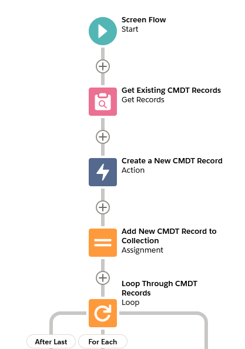

# Custom Metadata Saver for Salesforce

<a href="https://githubsfdeploy.herokuapp.com">
  
</a>

This is a small library that can be used in Salesforce to update & deploy changes to custom metadata types (CMDT) from Apex and Flow.

## Flow
Deploying CMDT changes from Flow consists of 3 actions
 * **Initalize a New Custom Metadata Record** (`CustomMetadataEditor.initalizeCustomMetadata(List<FlowInput> inputs)`) - this action creates a new in-memory instance of the specified CMDT object. is used to update a field on the custom metadata record. This is needed because Salesforce ignores any field changes on CMDT made in Flow. Each input has 3 attributes, and the `SObject` instance of the new CMDT record is returned.
    * `String customMetadataTypeName` = The API name of the CMDT object
    * `String masterLabel` - The value to use as the new CMDT record's label
    * `String developerName` - The value to use as the new CMDT record's unique name




 * `CustomMetadataEditor.editCustomMetadata(List<FlowInput> flowInputs)` - this is used to update a field on the custom metadata record. If you need to set multiple fields on a CMDT record, you will have to call this action multiple times (once per field update). Each input has 3 attributes:
    * `SObject customMetadataRecord` - The CMDT record to update
    * `String fieldName` - The API name of the field to update
    * `String fieldValue` - The new value to use for the field


 * `CustomMetadataSaver.deployCustomMetadata()` - this action will asynchronously deploy any pending changes made to CMDT records


## Apex
Since Apex can already update custom metadata records (it just can't save the changes using DML statements), it's a little easier to deploy the changes from Apex.
 * First, update your CMDT record's field values
 * Next, call the method `CustomMetadataSaver.addInstance(SObject customMetadataRecord)` (single record) or `CustomMetadataSaver.addAll(List<SObject> customMetadataRecords)` (list of records).
   * These methods register & track the custom metadata record provided - this enables the system to manage multiple updates made to the same CMDT record (e.g., you make changes to the same CMDT record via Flow and Apex).
   * You can call these methods multiple times if you are updating multiple CMDT records.
 * Finally, when you have finished making changes to the CMDT records, call `CustomMetadataSaver.deploy()` to start the async deployment. Any pending CMDT changes will be deployed in a single deployment.

```java
    // Create new CMDT record (or you can query existing records)
    CustomMetadataDeployTest__mdt myExampleCMDT = new CustomMetadataDeployTest__mdt();
    myExampleCMDT.MasterLabel = 'My CMDT Record';
    myExampleCMDT.DeveloperName = 'My_CMDT_Record';
    myExampleCMDT.ExampleTextField__c = 'Some value';

    // Add the new CMDT record to CustomMetadataSaver
    CustomMetadataSaver.addInstance(myExampleCMDT);

    // If you want, you can still make additional changes after adding it to CustomMetadataSaver
    myExampleCMDT.ExampleDateField__c = System.today();

    // Finally, deploy your changes
    CustomMetadataSaver.deploy();

    // Bonus, get the deployment job IDs if you want to monitor them
	List<Id> deploymentJobIds = CustomMetadataSaver.getDeploymentJobIds();
```